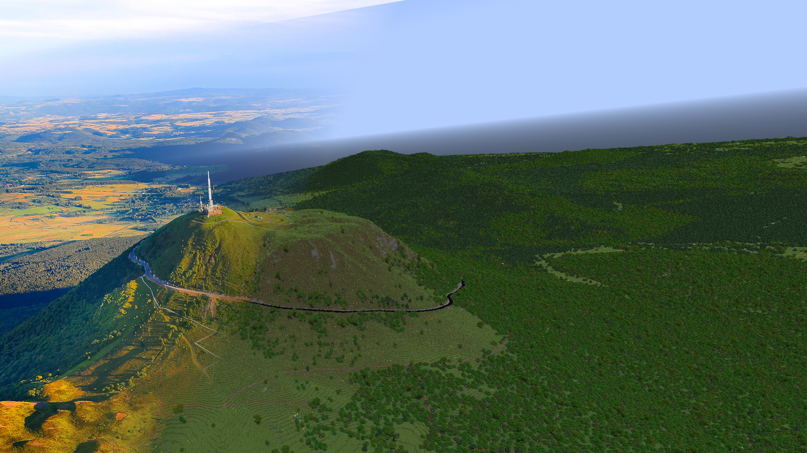

*Puy de Dôme, France*

*Venosc, Isère*

# francegen

Generate 1:1 Minecraft worlds (Java Edition 1.21.10+) from DEM, landuse and OSM data.

## Quickstart (users)

1. Install the Rust toolchain and collect GeoTIFFs that share the same projected coordinate system (e.g., LAMB93). DEM data from IGN is recommended: [Download here](https://cartes.gouv.fr/telechargement/IGNF_MNT-LIDAR-HD). LiDAR point clouds (COPC/LAZ) for buildings are available at [IGN LiDAR HD](https://cartes.gouv.fr/telechargement/IGNF_NUAGES-DE-POINTS-LIDAR-HD).
2. Run `francegen [options] <tif-folder> <output-world>` to build terrain, use `francegen locate <world> <real-x> <real-z>` to translate coordinates, and `francegen info <world>` for printing general information about a generated world.
3. Use a JSON config file provided in `examples/` or create your own
3. Dive into [User Getting Started](docs/users/getting_started.md) and the [User Configuration Reference](docs/users/configuration.md) for detailed CLI flags, metadata, and overlay configuration tips.

## Quickstart (developers)

1. Install the latest stable Rust via `rustup`.
2. Use `cargo fmt --all`, and `cargo build` before sending changes.
3. Get DEM data from [cartes.gouv.fr](https://cartes.gouv.fr/telechargement/IGNF_MNT-LIDAR-HD); LiDAR point clouds are at [IGN LiDAR HD](https://cartes.gouv.fr/telechargement/IGNF_NUAGES-DE-POINTS-LIDAR-HD)
4. Iterate with `cargo run -- --config examples/french_alps.json <tif-folder> <output-world>` to validate code against sample data.

## Recommended Minecraft environment

A good CPU and GPU are recommended, and large RAM allocation is a must. Worlds were generated and tested on an Ryzen 9 3900x, RTX 3070, with 40GB RAM allocated.

We recommend the use of [Voxy](https://modrinth.com/mod/voxy) and [C2ME](https://modrinth.com/mod/c2me-fabric) for rendering/chunk loading, and [Chunky](https://modrinth.com/plugin/chunky) for distant generation. [Distant Horizons](https://modrinth.com/mod/distanthorizons) should also work.

## Documentation

- [User Getting Started](docs/users/getting_started.md)
- [User Configuration Reference](docs/users/configuration.md)
